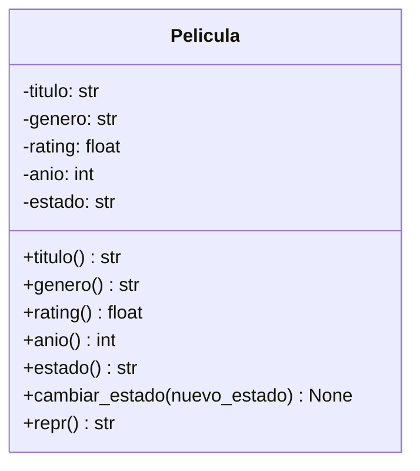

# Propuesta del proyecto

## Nombre del proyecto
    Cinapsis

## Dominio Elegido
    Peliculas
    
    Elegimos este dominio para poder ayudar a los usuarios a decidir rapido que pelicula ver, organizando los titulos segun las que ya vieron, sus gustos y generos, ademas de que a veces pasa mucho tiempo scrolleando sin decidir que ver.

## Problema que resuelve
    Con tantas plataformas de streaming (Netflix, HBO, Prime, Disney+), la gente termina agregando películas a "Mi lista" en cada app por separado, sin un lugar único donde ver todo lo pendiente, lo que ya vio y qué debería mirar hoy.

## Usuario objetivo
    Una persona que repite las películas o tarda 20 minutos scrolleando sin decidir que ver.

## 5 funcionalidades iniciales
1. Agregar Pelicula
2. Cambiar estado (Pendiente / Viendo/ Vista / Abandonada)
3. Listar Peliculas (genero o estado)
4. Sugerir Pelicula al azarde las pendientes
5. Ver estadisticas (total de peliculas vistas y genero)

## Ejemplo de interaccion (boceto de consola)
 Bienvenido a Cinapsis
1) Agregar película
2) Cambiar estado (Pendiente / Viendo / Vista / Abandonada)
3) Listar películas
4) Sugerir película pendiente
5) Ver estadísticas

Elegí una opción: 4
Deberías ver hoy: "Interstellar" (2014) - 169 min, género: Ciencia ficción.

## Diagrama inicial de clases
